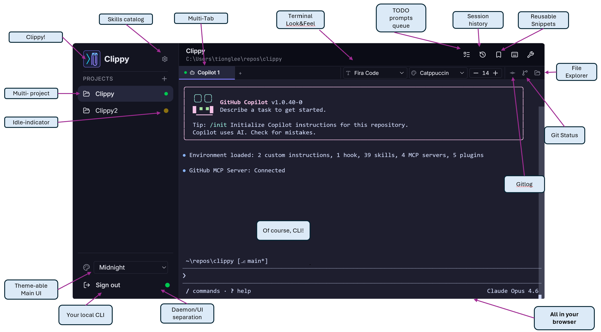

# Clippy

A GitHub Copilot CLI session manager with a web dashboard.

## Features


## Prerequisites

- **Node.js** ≥ 18
- **npm** ≥ 9
- **Git**
- **GitHub CLI** (`gh`) — required for Copilot CLI sessions ([install](https://cli.github.com/))
- A C/C++ toolchain for native modules (`node-pty`, `better-sqlite3`):
  - **Windows:** `npm install -g windows-build-tools` or install Visual Studio Build Tools
  - **Linux:** `sudo apt install build-essential python3` (Debian/Ubuntu) or equivalent

## Installation

### Linux / macOS

**One-liner** (install or update):

```bash
cd ~/.clippy/app 2>/dev/null && git pull --ff-only || gh repo clone tionglee_microsoft/clippy ~/.clippy/app && cd ~/.clippy/app && npm install && npm link
```

### Windows

**One-liner** (PowerShell, install or update):

```powershell
if (Test-Path $HOME\.clippy\app) { cd $HOME\.clippy\app; git pull --ff-only } else { gh repo clone tionglee_microsoft/clippy $HOME\.clippy\app; cd $HOME\.clippy\app }; npm install; npm link
```

**Installer script** (from a local clone, handles re-installs):

```powershell
.\scripts\install.ps1
```

> **Note:** `npm install -g "github:..."` does not work on Windows due to
> postinstall script issues with native dependencies (esbuild, better-sqlite3).
> Use the clone-based methods above instead.

## Usage

```bash
clippy
```

This starts the web dashboard at [http://localhost:3001](http://localhost:3001).

On first launch a default admin account is created — check the terminal output for credentials.

## Development

```bash
npm run dev
```

Opens Vite dev server at [http://localhost:5173](http://localhost:5173) with HMR, proxying API calls to the Express backend on port 3001.

### Useful commands

| Command | Description |
|---------|-------------|
| `npm run dev` | Start dev server (client + API with HMR) |
| `npm run build` | Production client build |
| `npm start` | Start production server |
| `npm test` | Run tests (Vitest) |
| `npm run test:watch` | Run tests in watch mode |
| `npm run daemon` | Start the session daemon standalone |

## Architecture

```
src/
├── client/      # React SPA (Vite)
├── server/      # Express API + WebSocket server
├── daemon/      # Session daemon (PTY lifecycle, survives server restarts)
├── shared/      # Shared modules (cli-bridge, types)
└── test/        # Vitest tests
```

The **session daemon** is a standalone process that owns all PTY sessions. It communicates with the Express server over a named pipe (Windows) or Unix domain socket (Linux/macOS). This means terminal sessions survive server restarts.
