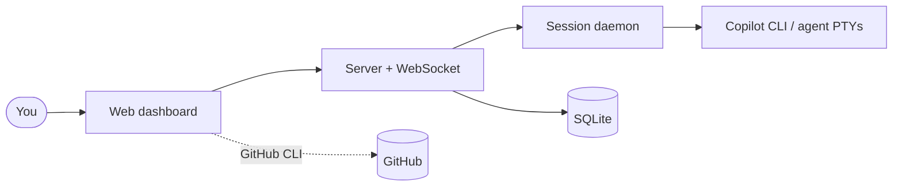

# Pilot Console — User Guide

Pilot Console is a GitHub Copilot CLI session manager with a web dashboard. It
lets you run and supervise many Copilot CLI and agent sessions across projects,
coordinate work through a **Project Lead** agent, track GitHub issues/PRs/boards,
and schedule recurring automated agent runs — all from one browser tab.

> New here? Start with **[Getting started](getting-started.md)**, then skim the
> **[Interface tour](interface.md)**.

## Contents

| Guide | What it covers |
|-------|----------------|
| [Getting started](getting-started.md) | Install, first launch, sign in, and shutdown. |
| [Interface tour](interface.md) | The sidebar, projects tree, split view, themes, and the floating Lead / Chief of Staff chat. |
| [Sessions & terminals](sessions.md) | CLI, shell and PowerShell tabs, the Copilot Agent pane, permissions, dictation, slash commands, and session sharing. |
| [Projects & GitHub](projects.md) | Creating projects, the board / issues / pull requests / milestones views, worktrees, and skills / MCP servers. |
| [Project Lead](project-lead.md) | The coordinating agent: delegating workers, server & artifact tabs, plan review, decisions, memory, and the merge queue. |
| [Automation](automation.md) | Scheduled agent runs, run history, and the report viewer. |
| [Settings & autonomy](settings.md) | Project settings and the Chief of Staff autonomy modes. |
| [Administration](admin.md) | User management, active sessions, and the session daemon. |

## The big picture

Pilot Console runs a **background daemon** that owns the terminal/agent
processes, so your sessions survive server restarts. GitHub features are powered
by your local **GitHub CLI** (`gh`) authentication — there is no separate login.

---

*These docs describe the shipping UI. Screenshots in `images/` are generated by
`npm run docs:screens` (see `../../scripts/docs-screenshots/README.md`) and can
be refreshed whenever the UI changes.*
