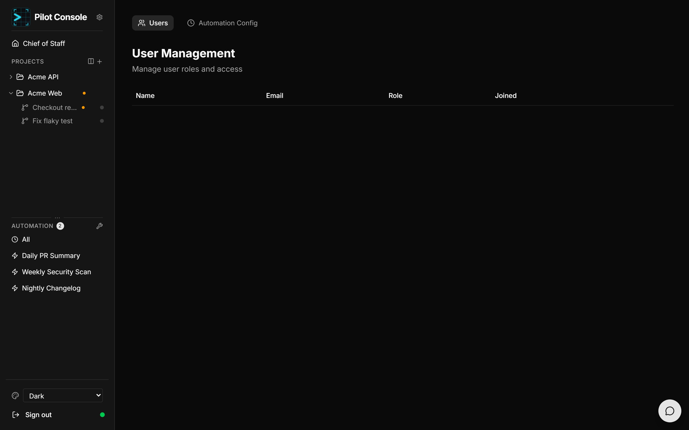
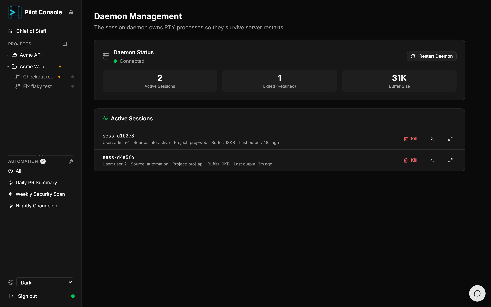

# Administration

Admin features are available to users with the **admin** role.

## User management

The **Admin** page lists all users with their login, email, role, and dates. Admins
can manage roles and access. Roles determine what a user can do (for example, only
admins can restart the daemon or kill other users' sessions).

## Active sessions

The **Sessions** view shows all active CLI/agent sessions across every user,
combining the database record with live daemon status so you can tell which
sessions are genuinely running. Admins can **kill** a session to reclaim resources
from hung or abandoned work.

## Session daemon

The **Daemon** page (reachable from the status dot at the bottom of the sidebar)
monitors and controls the background process that owns all terminal/agent PTYs —
the reason your sessions survive server restarts.

- **Status** — connected (green) or disconnected (red). If disconnected, **Start
  Daemon** brings it back; admins can also **Restart Daemon**.
- **Metrics** — active sessions, exited-but-retained sessions, and total output
  buffer size.
- **Active sessions** — each shows its id, owner, source (interactive/automation),
  project, buffer size, and last-output time. Admins can **kill** a session, or
  **view its buffer** inline or fullscreen (for exited sessions this is the final
  terminal state, useful for debugging).

The page polls the daemon periodically so the view stays current.
