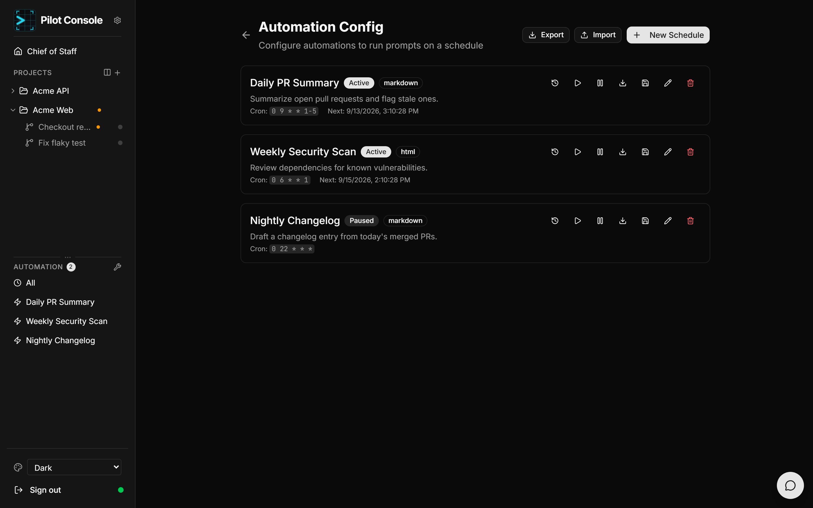
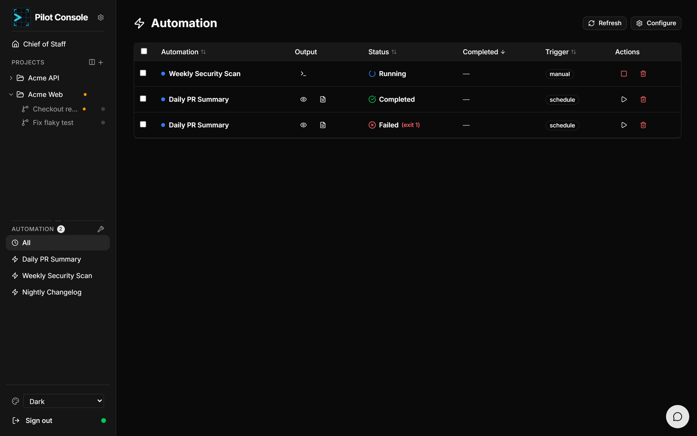

# Automation

Automation lets you run Copilot agent prompts on a **recurring schedule** and keep
the rendered results. Reach it from the **Automation** section of the sidebar.

## Schedules

Create a schedule with **+ New** (from a template or blank). Each schedule has:

| Field | Meaning |
|-------|---------|
| **Name** | Display name. |
| **Prompt** | The agent prompt to run. |
| **Cron expression** | When to run, e.g. `0 9 * * 1-5` (weekdays at 9am). |
| **Renderer** | Output format: `markdown`, `json`, `html`, or `plaintext`. |
| **Max runtime** | Timeout for a run. |
| **Runs retained** | How many completed runs to keep. |
| **Working directory** | Defaults to the project root. |

You can **enable/disable** a schedule without deleting it, **edit** or **delete**
it, **Run Now** to trigger immediately, and **save a schedule as a template** (with
a category) for reuse. **Import/Export** move schedules to and from JSON. A
template library provides ready-made Code Review, Security, Reporting, and
Maintenance schedules.

## Run history

The **All** view lists recent runs across every schedule. Filter by status
(`completed`, `running`, `failed`, `timed_out`, `pending`), search by schedule
name, and sort by date/status/name/exit code. Selecting a run shows an inline
**report preview**; running automations stream their output live, and an unread
badge marks runs you haven't looked at.

Opening a single schedule shows just **its** runs with status, start time,
duration, trigger, and exit code. You can expand a running job to watch live
output, open it fullscreen, or **kill** it.

## Report viewer

Click a completed run to open its **report**. Output is rendered to match the
schedule's renderer — Markdown (GitHub-flavoured), syntax-highlighted JSON, HTML
in a sandboxed iframe, or monospace plaintext — with a **Rendered ⇄ Raw** toggle.
The header shows status, renderer, start time, and exit code; the executed prompt
is available (collapsible); and **Open File** downloads the full output.
