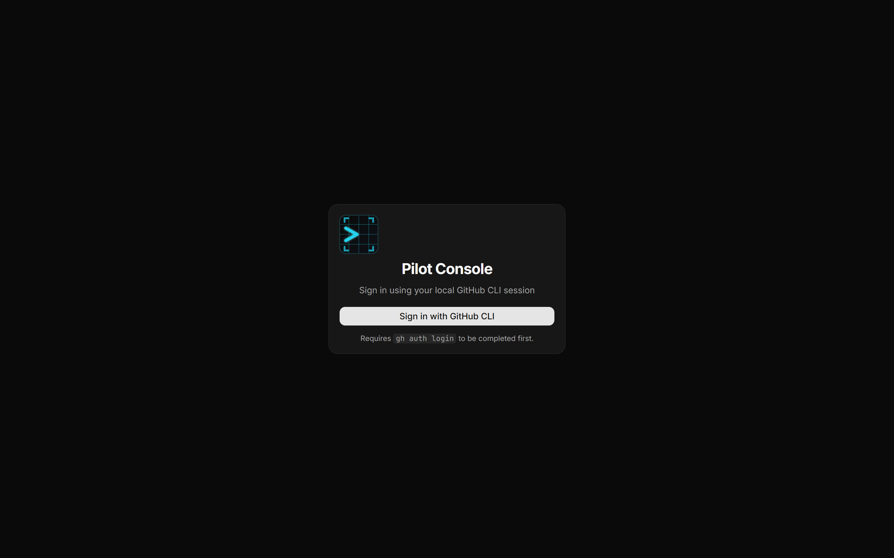
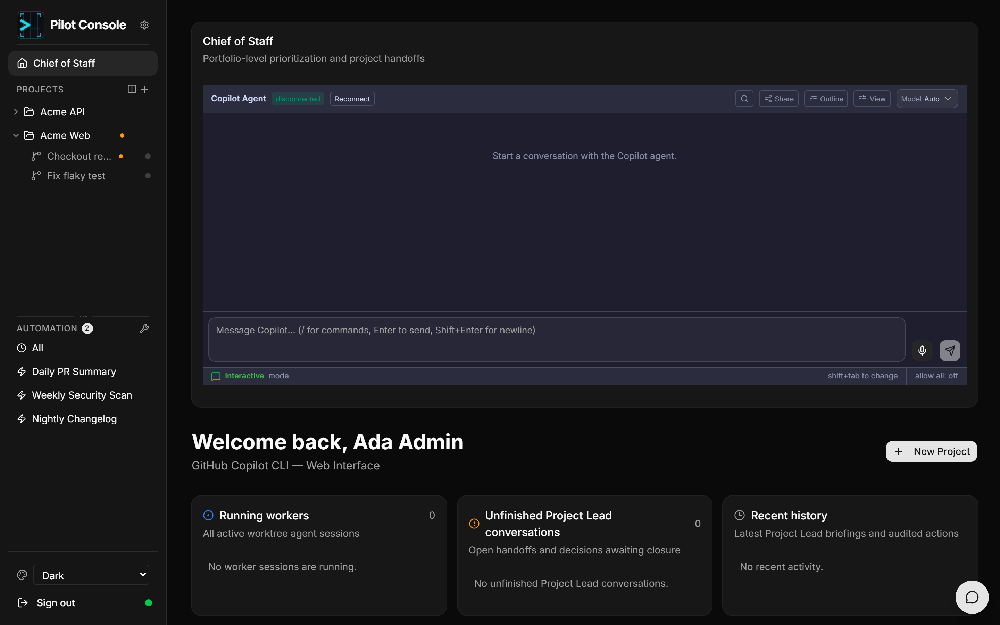

# Getting started

## Prerequisites

- **Node.js** ≥ 20 and **npm** ≥ 9
- **Git**
- **GitHub CLI** (`gh`), authenticated with `gh auth login` — Pilot Console signs
  you in using your local `gh` session, and all GitHub features run through it.
- A C/C++ toolchain for the native modules (`node-pty`, `better-sqlite3`):
  - **Windows:** Visual Studio Build Tools (or `npm install -g windows-build-tools`)
  - **Linux:** `sudo apt install build-essential python3` (Debian/Ubuntu) or equivalent

## Install

See the [project README](../../README.md#installation) for the one-liner and
installer-script options. In short, from a local clone:

```bash
npm install
npm link      # makes the `pilot-console` command available
```

## First launch

```bash
pilot-console
```

This starts the web dashboard at **http://localhost:3001**. On first launch a
default admin account is created — check the terminal output for the credentials.

> **Shutting down:** Pilot Console runs a background daemon that keeps your
> sessions alive even after you close the browser. To fully stop it, close the
> terminal where you ran `pilot-console` (or press `Ctrl+C` there).

## Sign in



Click **Sign in with GitHub CLI**. There is no password to manage — Pilot Console
authenticates against the GitHub CLI session already on your machine, so make
sure `gh auth login` has been completed first. If sign-in fails, the page shows
the reason (most commonly that `gh` is not authenticated).

## What you land on

After signing in you arrive at the **Chief of Staff** home page — your
portfolio-level overview across all projects.



From here you can:

- Chat with the **Chief of Staff** agent about work across every project.
- See **running workers**, **unfinished Project Lead conversations**, and
  **recent history** at a glance.
- Open any project from the left sidebar, or create one with **New Project**.

Next: take the **[Interface tour](interface.md)**.
