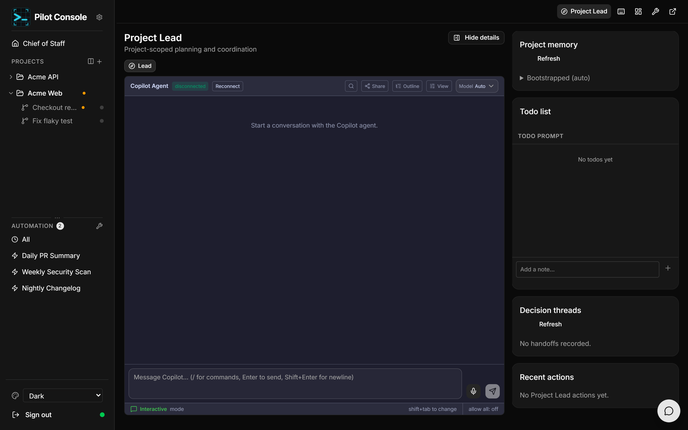
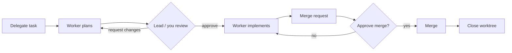

# Project Lead

The **Project Lead** is a Copilot agent that coordinates one project. It plans
work, delegates it to background workers, keeps a shared todo list, records
decisions, and asks for your approval before anything risky happens. Open it by
clicking a **project name** in the sidebar, the **Project Lead** button in any
project view, or the floating chat button.

## The workspace

- **Lead chat** (centre) — talk to the Lead like any Copilot agent. Ask it to
  plan a feature, split up work, start a server, review something, or clean up.
- **Detail panel** (right, toggle with **Hide/Show details**):
  - **Project memory** — the Lead's bootstrapped understanding of the repo
    (README, recent commits, worktrees, open decisions). **Refresh** re-synthesises
    it after big changes.
  - **Todo list** — the shared plan of record for the project. You and the Lead
    edit the same list; add notes directly here.
  - **Decision threads** — a durable record of key decisions (desired outcome,
    constraints, acceptance criteria, rationale, alternatives, follow-ups). You can
    mark threads **resolved** or **reopen** them.
  - **Recent actions** — an audit trail of what the Lead did, tagged by risk.

## Things you can ask the Lead to do

The Lead has tools for the whole delegation lifecycle. In practice you just ask in
plain language; behind the scenes it uses capabilities such as:

- **Delegate work** — start a background **worker** on a task. The worker gets its
  own worktree and session, **plans first**, and waits for the Lead's approval
  before touching files.
- **Review & steer workers** — approve or request changes on a worker's plan,
  **nudge** a live worker with guidance or an answer, or **cancel** one.
- **Run servers** — start/stop/restart a dev or API **server** with a live console.
- **Open artifacts** — render an HTML **artifact** (plan, diagram, comparison) in a
  live review tab and relay your feedback back into its turn.
- **Manage skills** — **suggest** a skill when it would help and, with your
  approval, **install** it (see [autonomy settings](settings.md)).
- **Track & decide** — maintain the todo list, record requirements/decisions, and
  brief the Chief of Staff.
- **Approve merges** and **clean up** finished worktrees.

## Worker tabs

Each delegated worker appears as its own tab, with a status badge
(`planning` → `awaiting_plan_review` → `working` → `blocked`/`done`/`closed`) and
an unread dot when it needs attention. Click a tab to watch that worker's session.

### Plan-review flow

The worker cannot change files until the plan is approved — this is the main
safety gate. What the Lead may do on its own (nudge, cancel, merge) depends on the
project's [autonomy settings](settings.md).

## Server tabs

When the Lead starts a server, it opens a **server tab** with the live console,
an uptime counter, a status badge (`starting`/`running`/`stopped`/`failed`), the
exit code on stop, and **Stop / Restart / Clear / Remove** controls. A badge near
the tab bar shows how many servers are running.

## Artifact tabs (live HTML review)

The Lead can open an **artifact tab** that embeds a live, interactive HTML review
surface (powered by the Lavish skill) — annotate it, edit Mermaid diagrams, and
leave feedback that flows back to the Lead. Controls include **Reload**, **Open
external**, and **Delete**.

## Merge queue

Pending merges surface in the **Merge Queue** on the Chief of Staff home page,
where you can **Approve**, **Reject** (with a reason), or force-release a stale
merge lock. Whether merges wait for you or proceed automatically is set by the
project's **merge mode**.

## Chief of Staff

The **Chief of Staff** is the portfolio-level counterpart to the per-project
Leads. It watches every project, raises alerts (blocked, stale, merge, decision)
in the floating **bell** widget, and can be chatted with from the floating window
anywhere. Each Lead periodically **briefs** the Chief of Staff so it stays aware
without reading full transcripts.
