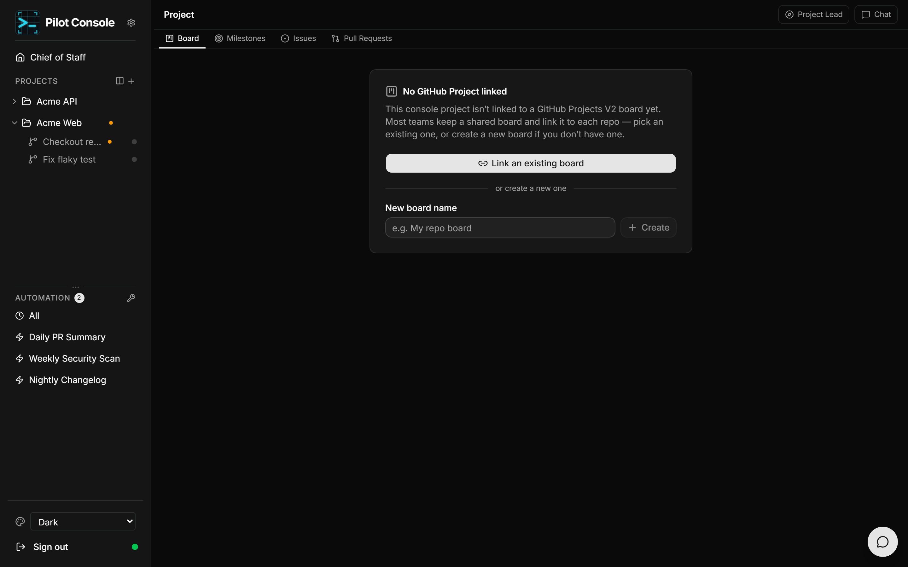
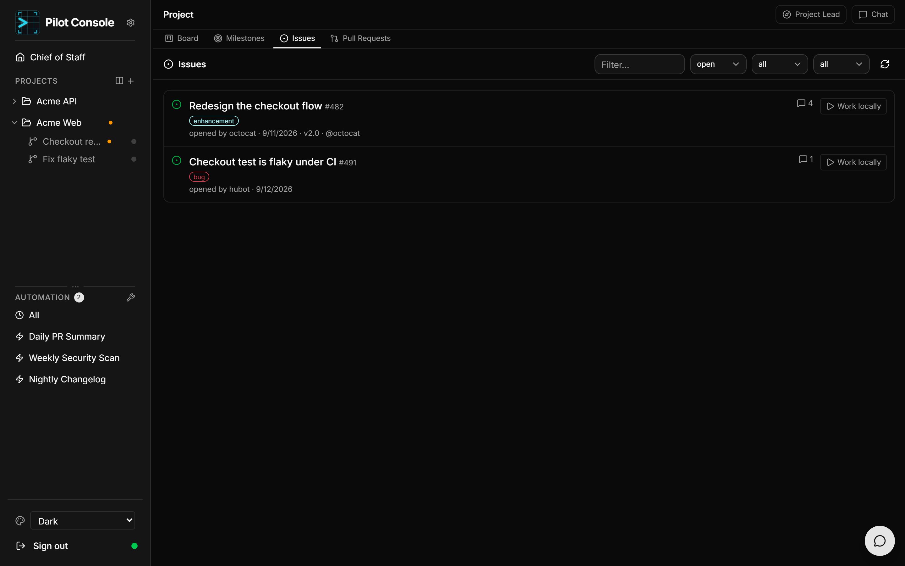
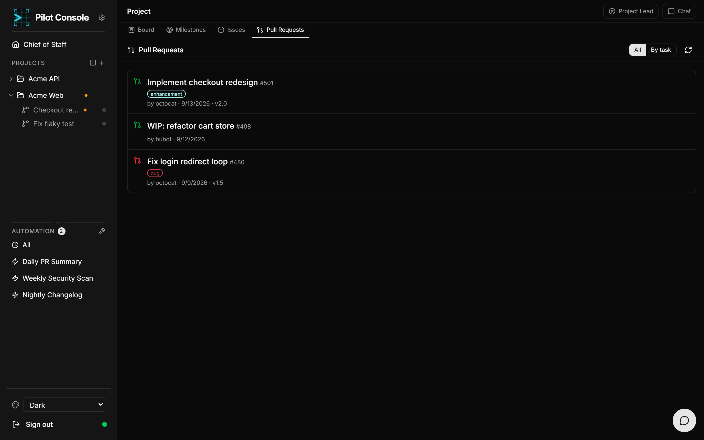
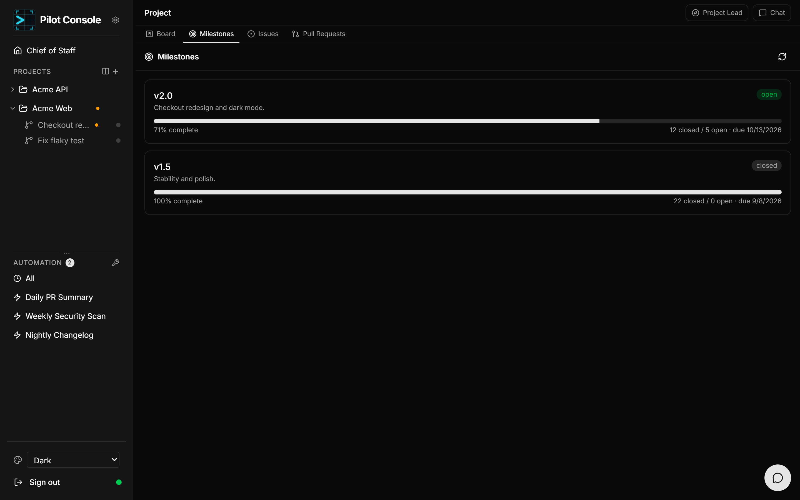
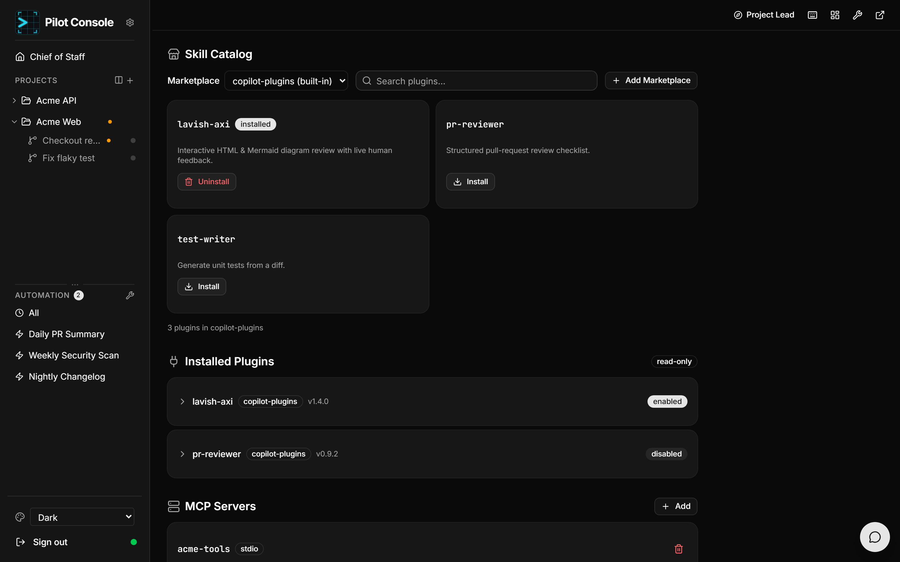

# Projects & GitHub

A **project** points Pilot Console at a local git repository. From a project you
get a chat workspace, a Project Lead, GitHub-backed views, worktrees, and skills.

## Create a project

Choose **New Project** (from the home page or the **+** by the *Projects* header)
and fill in:

- **Name** — the display name.
- **Repository path** — the local path to the repo. Pilot Console validates it
  live, telling you whether it's a valid git repository, a plain directory, or
  invalid. A folder picker is provided.
- **Description** — optional.

GitHub is *not* required to create a project; you connect it later from the board.

## Project views

A project has two faces:

- The **chat workspace** (`/projects/<id>/chat`) — terminals and agent tabs; see
  [Sessions & terminals](sessions.md).
- The **full-width GitHub view** (`/projects/<id>/view/...`) — Board, Milestones,
  Issues, Pull Requests. Switch to it from the dashboard icon in the project
  header, and jump back with the **Chat** button. The **Project Lead** button is
  always one click away.

All GitHub data comes from your local **GitHub CLI** authentication.

### Board

Link one or more **GitHub Projects (v2)** to your project, create a new one, or
switch between linked projects from the header dropdown. Each saved GitHub
Project **view** appears as a tab and renders as a **Kanban board**, **table**, or
**roadmap** depending on the view's layout. You can edit item fields inline and,
where you have permission, rename views. **Start work** on an item creates a
worktree branch for it.

### Issues

Browse repository issues with filters for **state** (open/closed/all), **label**,
and **assignee**, plus a text search. Each row shows labels, author, date,
milestone, assignees, and comment count. Click an issue to open its detail page,
or click **Work locally** to spin up a dedicated worktree and start a session on
an `issue-<number>` branch.

On the **issue detail** page you can read the rendered description, **edit** the
title and body (where permitted), and **Start work**.

### Pull requests

View PRs as a flat **All** list or grouped **By task** (under their linked board
items). Icons distinguish open, draft, closed, and merged PRs. Titles link out to
GitHub.

### Milestones

See each milestone's progress bar, completion percentage, open/closed counts, and
due date. Titles link to GitHub.

## Worktrees

A **worktree** is a separate git working directory tied to a branch — created when
you **Start work** on an issue (branch `issue-<number>`), or added manually from
the sidebar (**+** on a project → *Git worktree* or *Directory*). Each worktree
has its own chat sessions and context, and appears under its project in the
sidebar. From a worktree you can **Create PR** to open a pull request for its
branch. Worktrees persist until removed (the [Project Lead](project-lead.md) can
retire them once their work is merged).

## Skills & MCP servers

The project **Skills** page manages Copilot CLI extensions:

- **Skill catalog** — browse and install plugins from registered marketplaces,
  search by name/description, switch marketplaces, and register your own
  marketplace (a GitHub `owner/repo`). Installed plugins show an *installed*
  badge; install/uninstall is one click.
- **Installed plugins** — a read-only list of installed plugins, expandable to
  show each plugin's skills, with version and enabled/disabled state.
- **MCP servers** — add custom **Model Context Protocol** servers (name, command,
  args) to give the agent extra tools, and remove them again.

> The [Project Lead](project-lead.md) can also **suggest and install skills** for
> you, gated by the [skill-install mode](settings.md#chief-of-staff-autonomy)
> project setting.
