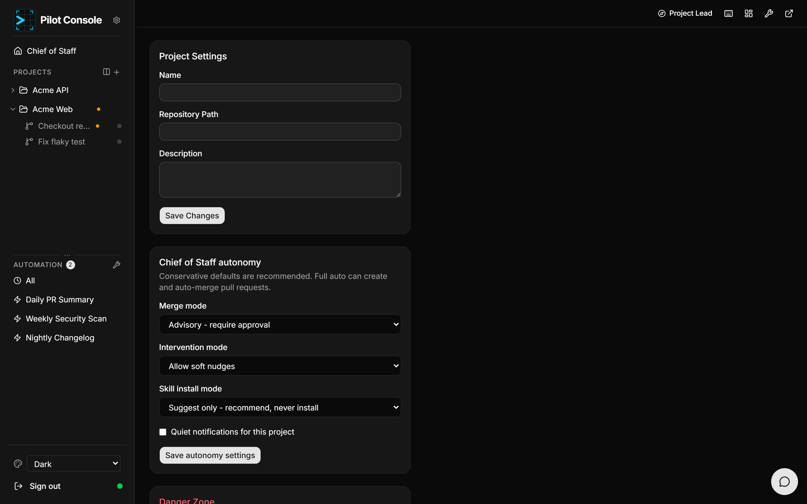

# Settings & autonomy

Open a project's settings from the **wrench** icon in its header, or at
`/projects/<id>/settings`.

## Project settings

- **Name** — display name.
- **Repository path** — the local path to the git repository.
- **Description** — optional free text.
- **Delete project** — removes the project from Pilot Console. Your git repository
  on disk is left untouched.

## Chief of Staff autonomy

These settings govern how much the Project Lead / Chief of Staff can do on their
own. Conservative defaults are recommended.

### Merge mode

How pull-request merges are handled:

| Value | Behaviour |
|-------|-----------|
| **Advisory** (default) | Require your approval before any merge. |
| **Auto-queue** | Automatically queue approved merges without extra approval. |
| **Full auto** | Request GitHub auto-merge directly — PRs can merge on their own once checks pass. |

### Intervention mode

What the Lead may do to a running worker without you:

| Value | Behaviour |
|-------|-----------|
| **Flag only** (default) | Only flag issues to you; take no autonomous action. |
| **Flag + nudge** | Also send soft guidance ("nudges") to workers. |
| **Flag + nudge + cancel** | Also cancel a worker mid-run. |

### Skill install mode

How the Lead handles skills/plugins it thinks would help:

| Value | Behaviour |
|-------|-----------|
| **Suggest only** (default) | Recommend a skill, but never install it. |
| **Approve & install** | Install a skill **after** you approve it via a click-to-answer prompt, then load it into the live session. |

Even in **Approve & install**, the Lead must ask for your approval first — it
never installs silently.

### Quiet notifications

Tick **Quiet notifications for this project** (do-not-disturb) to suppress this
project's notifications.

> Settings are saved per project. The autonomy settings apply to both the
> per-project [Project Lead](project-lead.md) and the portfolio Chief of Staff.
